# 前言
小编之前经常对群里的网友说“几十块钱的捉包都可以捉Mesh数据包的话，那Ellisys和Frontline不就倒闭了吗？”后来发现小编还是太“草率”了；

随着科技地不断发展，目前是可以使用低成本的硬件来实现Mesh数据的捉包与解密的，那么到底是怎么做的呢？Here we go!

# 前期准备
首先，我们需要如下几个工具：
- [红旭无线的52840 Dongle](https://item.taobao.com/item.htm?spm=a1z10.3-c-s.w4023-22232069203.13.753f3551e5TkFc&id=598472801867) 
	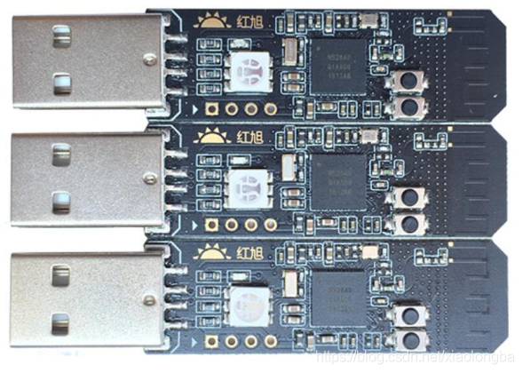

- 大名鼎鼎的协议分析软件[Wireshark](https://www.wireshark.org/)
	
    

	> 安装最新的版本即可

- [Python 3.6](https://www.python.org/downloads/)以上
    > 注意：安装时需要将pip也安装上
- [nRF Sniffer for Bluetooth LE](https://www.nordicsemi.com/Software-and-Tools/Development-Tools/nRF-Sniffer-for-Bluetooth-LE/Download#infotabs)
    > 下载最新的版本即可
- [nRF Connect for Desktop](https://www.nordicsemi.com/Software-and-Tools/Development-Tools/nRF-Connect-for-desktop)
    > 下载最新的版本即可

至于，上述提及到的Python、Wireshark以及nRF Connect for Desktop的软件安装这里不表（因为我实在想不明白连个软件都不会安装的工程师为什么还来做技术开发）；

# 烧录抓包固件
在烧录之前，我们还需要在nRF Connect for Desktop中安装nRF Connect Programmer（安装过程不表），安装后的界面如下图所示：

打开Programmer便可以对红旭的52840 Dongle进行捉包固件地烧录，其中捉包的固件在nRF Sniffer for Bluetooth LE中可以找到，如下图所示：
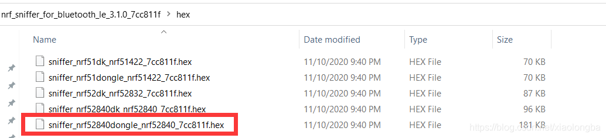
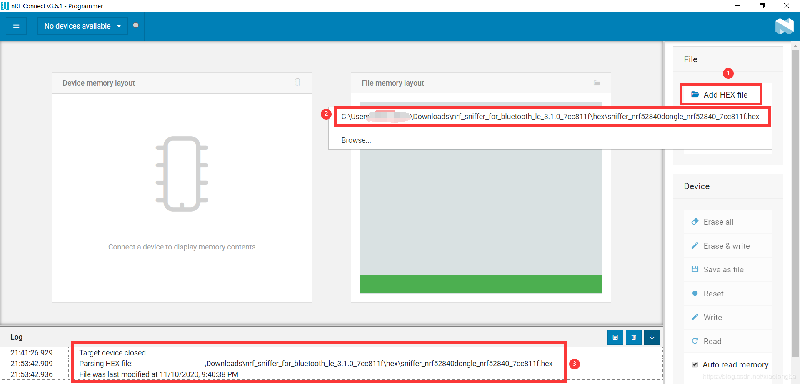
1. 增加抓包的固件
2. 抓包固件的路径
3. 最后装载成功后的显示

加载抓包固件之后，插入[红旭无线的52840 Dongle](https://item.taobao.com/item.htm?spm=a1z10.3-c-s.w4023-22232069203.13.753f3551e5TkFc&id=598472801867)；如果驱动安装正常的话，一般此时Programmer会找到映射的串口，如下图所示：
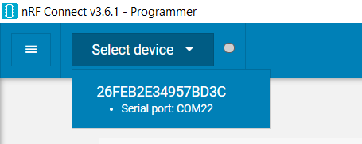
但是，此时先**暂不选择串口**，还需要按下下图红色高亮的按键进入USB DFU模式：
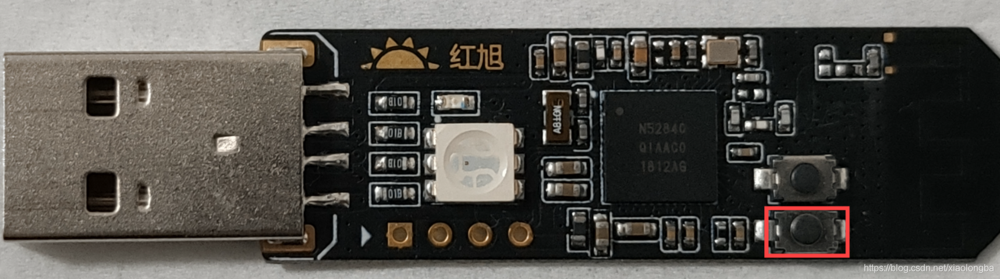
如果此时红灯闪亮，则说明Dongle已经进入了USB DFU模式，现在可以选中该设备并进行抓包固件的烧录；

如果出现下图所示界面，则说明连接Dongle成功且可以正常进行固件烧录：
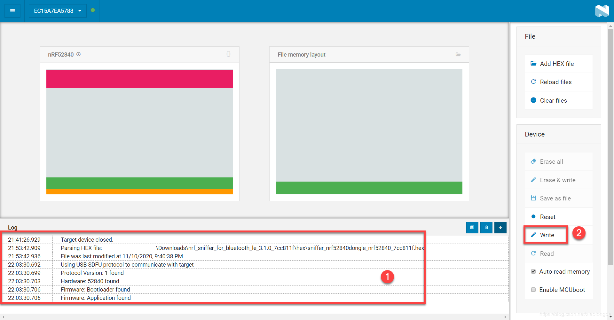
1.  表示跟Dongle建立连接成功
1. 烧录抓包固件

如果上述的操作均正确且正常的话，那么最终会出现如下界面：
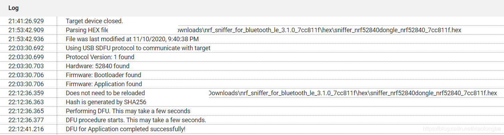
此时，抓包固件已经烧录完成了，接下来我们继续配置软件。
# 软件配置
因为我们最终是调用Wireshark对抓取到的数据包进行协议分析，所以我们此时还需要对上述下载的
[nRF Sniffer for Bluetooth LE](https://www.nordicsemi.com/Software-and-Tools/Development-Tools/nRF-Sniffer-for-Bluetooth-LE/Download#infotabs)进行配置，操作如下所示:
1. 在**Sniffer_Software/extcap/** 文件夹中打开CMD并安装相应的依赖包，以下是小编的路径：
	> F:\Bluetooth\Nordic\Sniffer\nrf_sniffer_for_bluetooth_le_3.1.0_7cc811f\extcap

	以及命令

	> pip3 install -r requirements.txt
	
	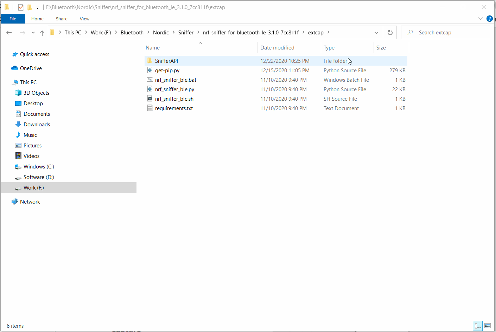
因为小编已经安装过了，所以提示说已经安装完成；如果是第一次安装的话就会自动下载相应的依赖包；
2. 复制Nordic的捉包工具到Wireshark的文件中：

    a. 打开Wireshark软件，并选择**Help** --> **About Wireshark**
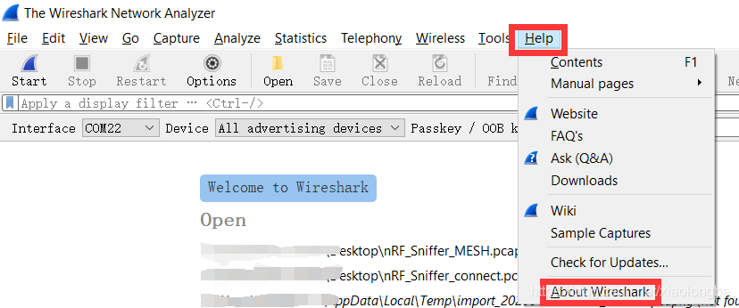
b. 选择 **“Floders”** ，并双击**Global Extcap path**就会跳到相对应的路径，并复制**Sniffer_Software/extcap/**文件夹中的内容：

c. 基本上，这个时软件的配置已经完成了；此时我们在复制后的这个目录下，可以用如下命令进行验证是否配置成功：
	> nrf_sniffer_ble.bat --extcap-interfaces

	采用上述在本目录下打开CMD的方法，输入上述的指令，如果出现下述的界面则说明配置成功：
	
# 抓包原理
可能有读者此时有点不耐烦了，但是在开始抓包之前，小编觉得还是很有必要跟大家讲讲这个抓包原理到底是怎么样的；废话不多说，老规矩---上图！！！
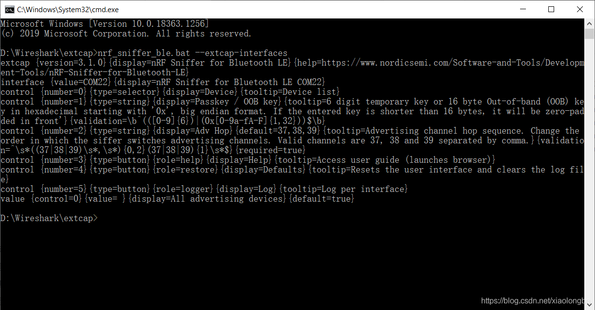
从上图可知，如果仅仅是抓取广播包的话，那么就省事多了，直接对着37，38，39三个广播信道扫描，然后对抓取到的数据进行解析即可；当然如果是扩展广播包的话，可能会比较麻烦些，但是这个小编以后会专门开个章节进行讲解；众所周知，BLE连接上之后每个连接间隔都是会跳频的，那么这个时候抓包器又是怎么捉的呢？BLE 5.0之前，跳频的步长是固定的，但是5.0之后跳频的步长则变成随机了，这样对抓包器的要求就更高了；但是，再复杂也是通过数学公式计算出来的，现在后悔没有把数学学好吧？

由于5.0之后的跳频算法比较复杂，小编这里不表，感兴趣的读者可以自行阅读Spec；但是，像小编这样的学渣来说，有没有办法通过输入某些值，即可算出跳频的列表呢？答案：当然是有的，这个时候就不得不祭出一个神器了，先让大伙看看效果：
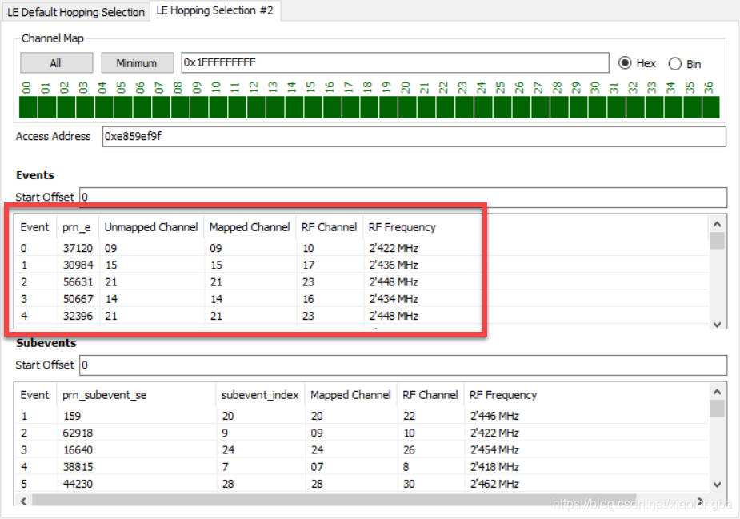
红色高亮是计算出来的跳频列表，而下图是实际抓包时的数据通道列表：
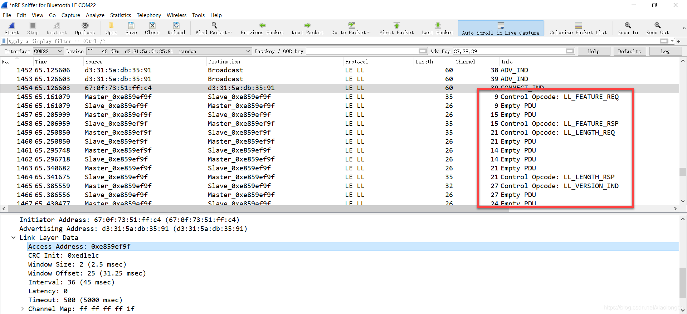
从上述的两幅图，我们可以看到第0~4个连接事件的跳频信道跟抓包得到的数据信道是完全一样的；其中**CONNECT_IND**的消息携带有**Access Address**，我们利用神器只要将**Access Address**值的内容输入进去即可计算出整个跳频列表；同理，抓包器就利用这个**CONNECT_IND**的消息，计算出下一个信道在哪里，**从而实现抓包的目的，这也是为什么在抓取数据包时，一定要在广播前就打开Sniffer，否则抓取不到数据包**；
# 开始抓包
接下来，小编正式讲解开始本篇文章的重点，也是大家最喜欢的环节，那么怎么使用[红旭无线的52840 Dongle](https://item.taobao.com/item.htm?spm=a1z10.3-c-s.w4023-22232069203.13.753f3551e5TkFc&id=598472801867)进行抓取Mesh数据包并解密呢？
1. 首先，打开Wireshark选择[红旭无线的52840 Dongle](https://item.taobao.com/item.htm?spm=a1z10.3-c-s.w4023-22232069203.13.753f3551e5TkFc&id=598472801867)，如下图所示：
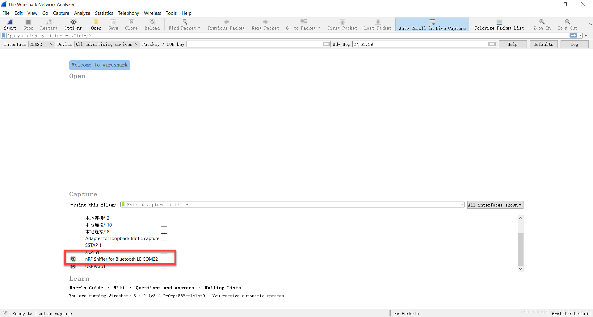
2. 双击上图中的 **“nRF Sniffer for Bluetooth LE COM22”**，即可开始抓包
3. 由于我们周边会大量存在其他我们不想要的BLE数据包，那么这个时候就需要过滤一下，这里小编过滤了普通的BLE数据包，只保留了Mesh相关的数据包以及用于测试那个设备，过滤的命令如下：
	> ((pbadv) || (provisioning)||(btmesh)||(beacon) ) && ((btle.advertising_address == eb:7b:7a:14:1c:02)||(btle.advertising_address == d3:31:5a:db:35:91))

	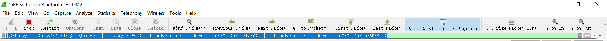
4. 其中一个 [HX-DK-夏 Z1A00](https://item.taobao.com/item.htm?spm=a1z10.1-c-s.w4004-22261057662.6.43ba2c2cqFeXqh&id=608555326842)下载Nordic官方的Light_Switch固件，另外一个 [HX-DK-夏 Z1A00](https://item.taobao.com/item.htm?spm=a1z10.1-c-s.w4004-22261057662.6.43ba2c2cqFeXqh&id=608555326842)下载Nordic官方的Provisioner固件
5. 按下Provisioner那个开发板的**Button 1**，此时Provisioner这个开发板就开始对未入网的设备进行配网
6. 这个时候[红旭无线的52840 Dongle](https://item.taobao.com/item.htm?spm=a1z10.3-c-s.w4023-22232069203.13.753f3551e5TkFc&id=598472801867)就会将整个入网过程抓取，并显示在Wireshark界面上；然而，我们大家都知道，Mesh入网之后所有的数据都是通过加密的，那么如果解密呢？这个其实跟Ellisys是一样的，只要输入Netkey,Appkey,DevKey以及IV Index即可；随便选中一个加密后的Mesh数据包，将前面提到的内容填充进去，具体操作如下：
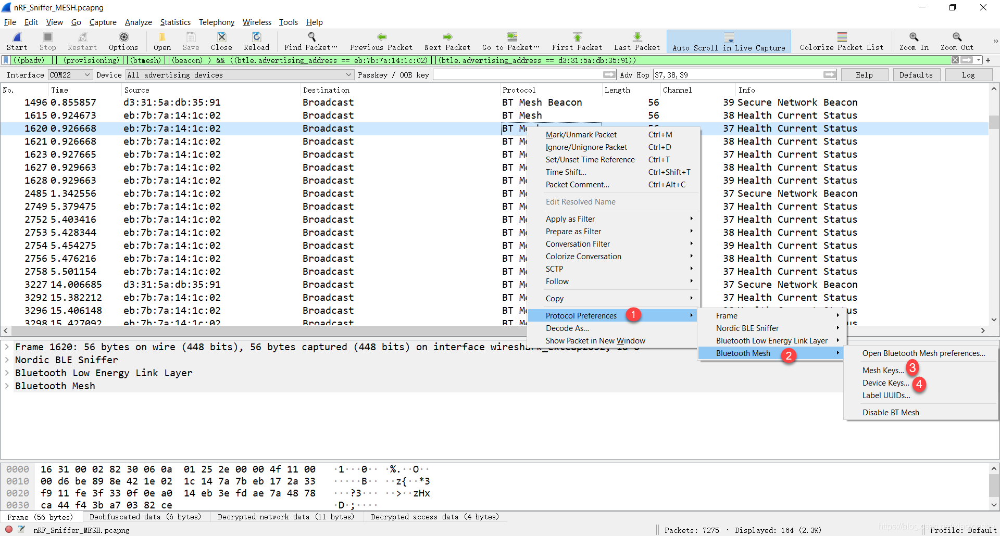
按照上图中的步骤填充Netkey,Appkey,DevKey以及IV Index，这里以小编的为例：
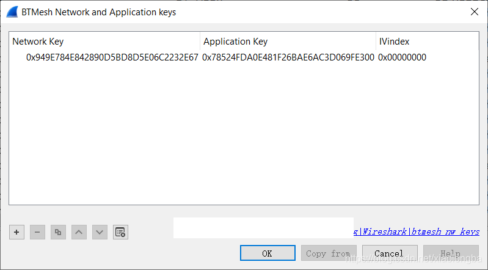
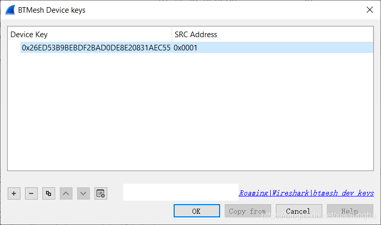
需要注意的是：**所有的Key都要在前面加上“0x”，其中SRC Address指的是节点元素的首地址**；至此，Wireshark就可以解析所有Mesh加密之后的内容了；
# 实验结果
下面是小编用[红旭无线的52840 Dongle](https://item.taobao.com/item.htm?spm=a1z10.3-c-s.w4023-22232069203.13.753f3551e5TkFc&id=598472801867)抓取到的Mesh入网以及配置的整个过程：
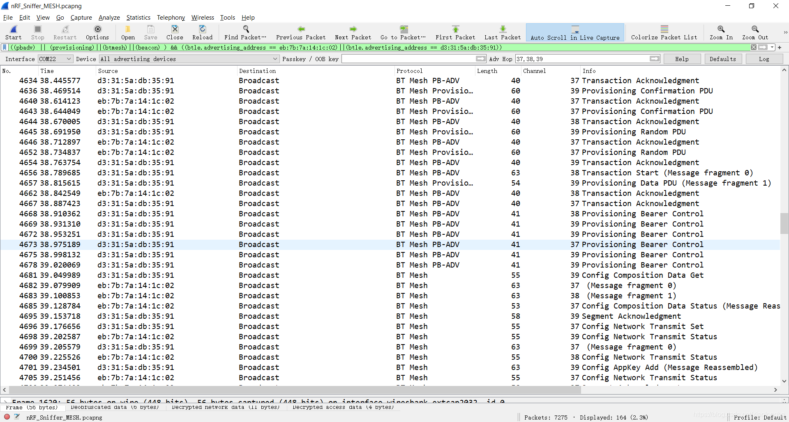
